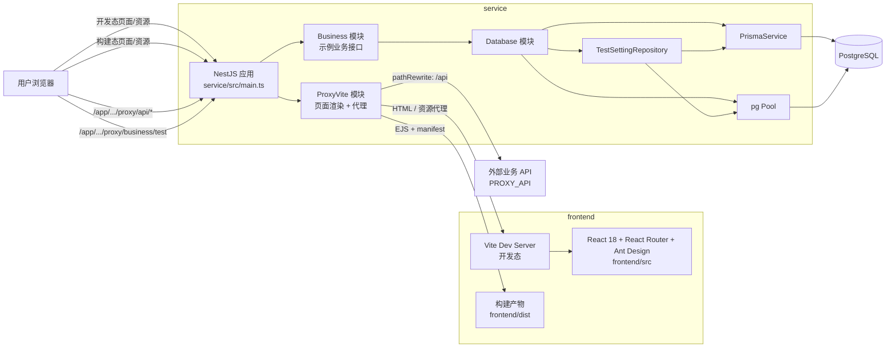
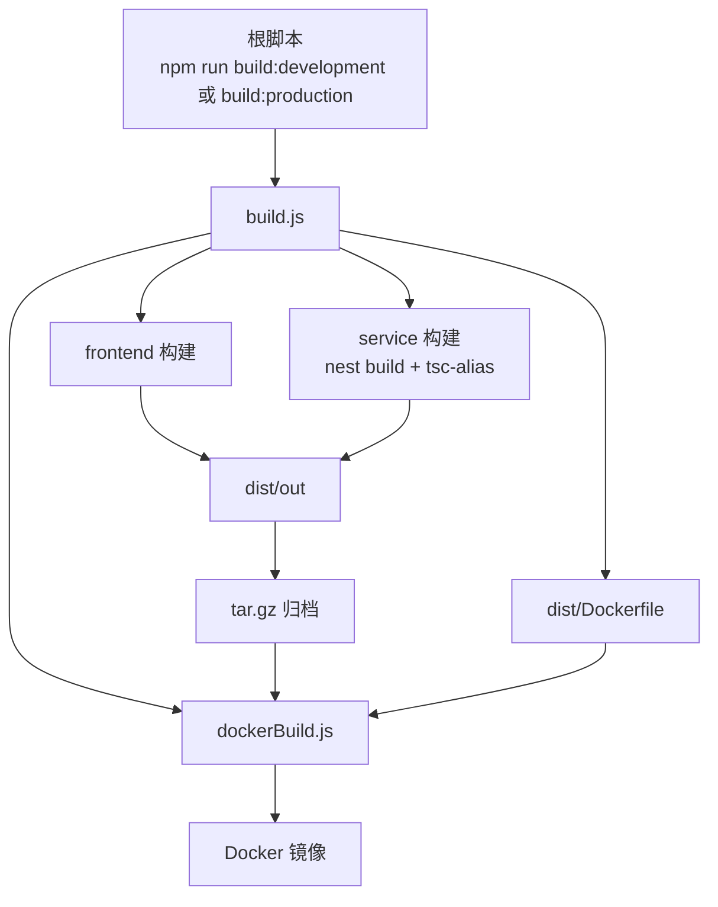

# 项目架构图

## 系统总览

## 构建与离线镜像流程

## 关键说明

- 开发态由 `service` 充当前端入口和 API 入口，HTML 与静态资源通过 `ProxyViteService` 转发到本地 Vite。
- 构建态由 `service` 直接托管 `frontend/dist`，并通过 `manifest.json` 注入前端资源。
- 数据库访问统一收敛在 `DatabaseModule`，其中 `PrismaService` 负责 ORM 主路径，`pg Pool` 负责健康检查和复杂 SQL 下钻。
- 根目录 `build.js` 会同时产出前后端打包结果，并生成可用于 Docker 离线分发的归档、`Dockerfile` 和 `docker-compose.yml`。
